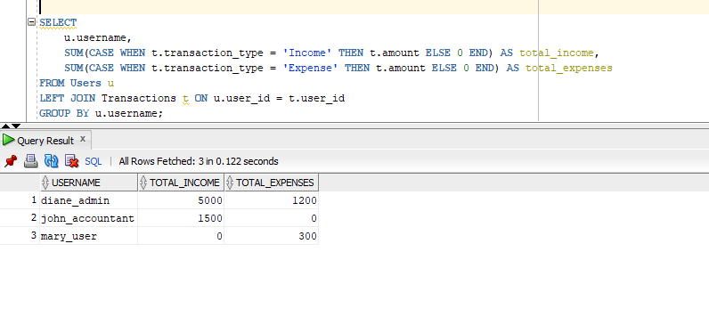
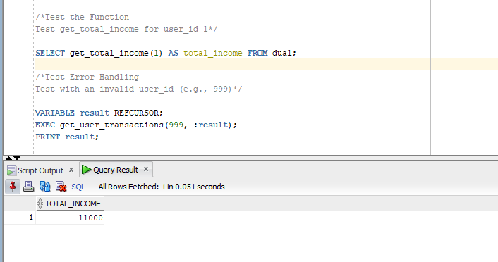

# 💰 Income and Expense Management System - PL/SQL Capstone Project

## 📝 Introduction
**Student Name:** HABIMANA ISHIMWE Diane  
**Student ID:** 25408  
**Group:** Tuesday  
**Course:** Database Development with PL/SQL INSY 8311  
**Lecturer:** Eric Maniraguha  
**Academic Year:** 2024-2025  

## 🎯 Problem Statement
Many individuals and businesses struggle with financial management due to inefficient tracking of income and expenses. Manual processes often result in errors, loss of data, and poor financial decision-making. This project aims to develop an automated PL/SQL-based Oracle database solution to improve financial tracking and reporting.


**Context & Users:**
- Individuals managing personal finances
- Small businesses & startups tracking cash flow
- Financial managers & accountants

**Project Goals:**
- Automate financial record-keeping with PL/SQL
- Enhance data integrity & security
- Provide real-time financial insights

---

## 📊 Project Phases Documentation

### 1️⃣ Phase 1: Problem Statement
[View Phase 1 Presentation](Tues_25408_Diane_PLSQL.pptx)

- Identified financial tracking challenges
- Defined project scope and objectives
- Presented key entities and benefits

### 2️⃣ Phase 2: Business Process Modeling
**Objective:** Modeled the business process for financial transaction processing and reporting.

**Deliverables:**

-Business process diagram using UML/BPMN.

-Explanation of how the process supports MIS functions (e.g., operational efficiency, decision support).

**Key Entities:**

**Users:** Input transactions and view reports.

**Accountant:** Reviews data integrity and audits reports.

**System (DB):** Validates, stores, and categorizes transactions.

**Budget Module:** Checks if transactions exceed set limits.

**Report Generator:** Compiles summaries and trend graphs.
**Holidays:** Purpose: Restrict updates on specific dates (auditing logic).


[Phase 2 Documentation](Phase2.pdf)

### 3️⃣ Phase 3: Logical Model Design


[Phase 3 Documentation](phase3.pdf)

**Database Entities:**
1. **Users**
   - `user_id (PK)`, `username`, `password`, `role`, `email`
2. **Categories**
   - `category_id (PK)`, `category_name`, `category_type`, `description`
3. **Transactions**
   - `transaction_id (PK)`, `user_id (FK)`, `category_id (FK)`, `amount`, `transaction_date`
4. **Budgets**
   - `budget_id (PK)`, `user_id (FK)`, `category_id (FK)`, `budget_amount`, `start_date`, `end_date`
5. **Reports**
   - `report_id (PK)`, `user_id (FK)`, `report_type`, `generated_at`, `report_data`
6. **Holidays**
   -`holiday_id (PK)`, `holiday_date`, `holiday_name`
### 4️⃣ Phase 4: Database Creation
**Objective:** Created a pluggable database (PDB) for the project.

**Deliverables:**

-Database named Tues_25408_Diane_ExpenseIncome_DB.


-Granted super admin privileges to the user.


-All project data and activities are stored in this PDB.
-my script


### 5️⃣ Phase 5: Table Implementation
**Objective:** Implemented the logical design by creating tables and inserting realistic data.

**Deliverables:**

-Created tables: **Users**, **Categories**, **Transactions**, **Budgets**, **Reports**, **Holidays**.


-Inserted sample data for testing and demonstration.


**Sample Table Creation:**
```sql
CREATE TABLE Users (
    user_id NUMBER GENERATED ALWAYS AS IDENTITY,
    username VARCHAR2(50) NOT NULL,
    password VARCHAR2(100) NOT NULL,
    role VARCHAR2(20) NOT NULL,
    email VARCHAR2(100),
    created_at DATE DEFAULT SYSDATE,
    CONSTRAINT pk_users PRIMARY KEY (user_id)
);
```
-Test for total income and expenses



-Test for budget amount, actual spent


-Test the holiday


### 6️⃣ Phase 6: Database Operations
### Objective
Enable effective database operations with modular programming.
### Database Operations
Performed DML (INSERT, UPDATE, DELETE) and DDL (ALTER) operations.


### Task Requirements

#### Simple Problem Statement
Analyzed income trends using window functions to calculate running totals for financial insights.

#### Procedures and Functions
- Created `get_user_transactions` procedure with cursors and exception handling to fetch user transactions.
- Created `get_total_income` function to compute total income for a user.
- 





#### Testing
Validated operations via SQL queries and procedure calls (e.g., tested for `user ID` and invalid user IDs).


#### Packages
Organized procedures and functions in `income_expense_pkg` for modularity.

  


 


### 7️⃣ Phase 7: Advanced Database Programming and Auditing

### Objective
Enhance the system with advanced PL/SQL features and auditing mechanisms.

### Problem Statement Development

#### Need
Triggers and auditing are essential to enforce transaction restrictions and ensure accountability in financial management.

#### Restriction Rule
Block INSERT, UPDATE, DELETE on Transactions during weekdays (Monday to Friday) and public holidays in June 2025.

#### Justification
Enhances security by controlling access and provides traceability of user actions, aligning with the system's goal of reliable financial tracking.

### Implementation

#### Trigger Implementation
- **Simple Trigger**: `restrict_transactions` checks the current day and holidays, raising errors if conditions are violated.
  
- **Compound Trigger**: `compound_restrictions` for complex operations across multiple rows, ensuring consistency.
- Used `Holidays` table to store and check holiday dates (e.g., National Heroes Day on June 1, 2025).

#### Auditing System
- Created `Audit_Logs` table to track user actions.
- Captured: 
  - User ID
  - Date/time
  - Operation
  - Table name
  - Status (ALLOWED/DENIED)
  - Error message
- Implemented auditing via triggers and the `log_audit_action` procedure in `income_expense_pkg`.

---

### Key Code Implementations

```sql
-- Audit Table Creation
CREATE TABLE Audit_Logs (
    audit_id NUMBER GENERATED ALWAYS AS IDENTITY,
    user_id NUMBER,
    action_date DATE DEFAULT SYSDATE,
    operation VARCHAR2(10) NOT NULL,
    table_name VARCHAR2(50) NOT NULL,
    status VARCHAR2(10) NOT NULL,
    error_message VARCHAR2(500),
    CONSTRAINT pk_audit_logs PRIMARY KEY (audit_id)
);

-- Restriction Trigger
CREATE OR REPLACE TRIGGER restrict_transactions
BEFORE INSERT OR UPDATE OR DELETE ON Transactions
FOR EACH ROW
DECLARE
    v_day_of_week VARCHAR2(10);
    v_holiday_count NUMBER;
BEGIN
    v_day_of_week := TO_CHAR(SYSDATE, 'DY');
    
    IF UPPER(v_day_of_week) IN ('MON', 'TUE', 'WED', 'THU', 'FRI') THEN
        RAISE_APPLICATION_ERROR(-20003, 
            'Table manipulations not allowed on weekdays');
    END IF;
    
    -- Holiday check implementation
    SELECT COUNT(*) INTO v_holiday_count
    FROM Holidays
    WHERE holiday_date = TRUNC(SYSDATE)
    AND holiday_date BETWEEN TO_DATE('2025-06-01', 'YYYY-MM-DD') 
                        AND TO_DATE('2025-06-30', 'YYYY-MM-DD');
    
    IF v_holiday_count > 0 THEN
        RAISE_APPLICATION_ERROR(-20004, 
            'Table manipulations not allowed on holidays');
    END IF;
END;
```
- Test 1: Attempt an Insert on a Weekday (Simulate May 23, 2025, a Friday)

   

   

  
- Test 2: Attempt an Insert on a Holiday (Simulate June 1, 2025)
  
   

  
   

  
- Test 3: Attempt an Insert on a Weekend (Today is Saturday, May 24, 2025)

  
   

  
   

  
- Implemented security triggers
- Created audit logging system
- Added transaction restrictions
